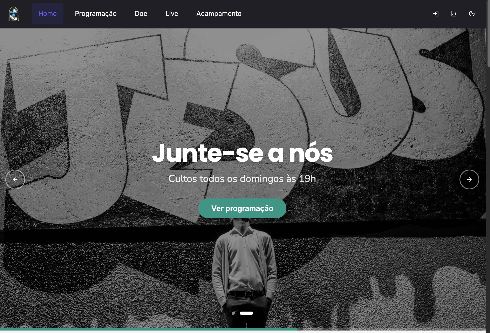
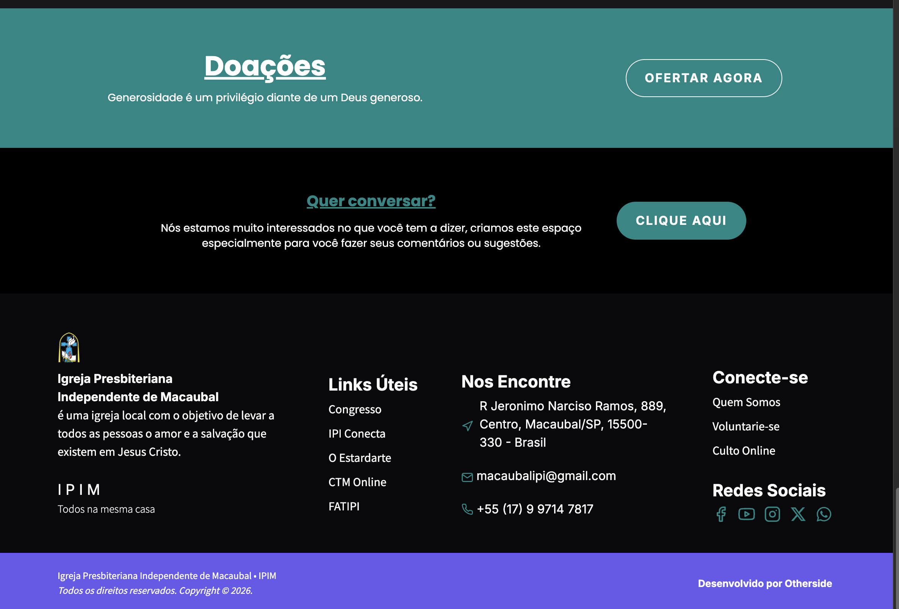

# IPIM Web App

Aplicacao web desenvolvida para a Igreja Presbiteriana Independente de Macaubal, com foco em experiencia moderna, identidade visual consistente e recursos administrativos para operacao de conteudo e eventos.

Este repositorio representa um projeto real de interface e produto digital, pensado para atender publico final e area interna em uma mesma base, com frontend escalavel, componentes reutilizaveis e integracao com servicos externos.

## Visao Geral

O projeto combina uma camada publica institucional com recursos utilitarios e uma area administrativa autenticada. A proposta foi entregar uma experiencia responsiva, visualmente forte e simples de manter.

### Destaques do Projeto

- Interface institucional moderna com foco em apresentacao, agenda, transmissao e contato.
- Area administrativa para gestao de eventos.
- Autenticacao por magic link com Supabase.
- Formularios com validacao tipada usando React Hook Form + Zod.
- Arquitetura baseada em componentes reutilizaveis.
- Tema claro/escuro e cuidado com transicoes, feedbacks e estados visuais.

## Preview Visual

### Home



### Footer e identidade visual



## O Que Este Projeto Demonstra

Este projeto foi construido para evidenciar capacidade de:

- transformar uma necessidade real de negocio em uma interface coesa;
- estruturar um frontend moderno com boa separacao de responsabilidades;
- integrar autenticacao e dados externos em um fluxo funcional;
- trabalhar com design responsivo, componentes reutilizaveis e consistencia visual;
- desenvolver uma experiencia pensada tanto para usuario final quanto para operacao interna.

## Funcionalidades Entregues

- Landing institucional com secoes informativas e blocos visuais de destaque.
- Pagina de transmissao ao vivo com integracao de conteudo externo.
- Programacao e agenda de eventos.
- Pagina de contribuicao com PIX e outras formas de apoio.
- Experiencia dedicada para campanha/acampamento com video e catalogo de conteudo.
- Login administrativo por envio de link magico por e-mail.
- Dashboard interna para gerenciamento de eventos.
- CRUD de eventos com formulario tipado, modal e feedback visual.

## Stack Principal

### Frontend

- React 19
- TypeScript
- Vite
- TanStack Router
- Tailwind CSS

### UI e experiencia

- Radix UI
- Lucide React
- Embla Carousel
- Sonner
- next-themes

### Formularios e validacao

- React Hook Form
- Zod
- @hookform/resolvers

### Backend e servicos

- Supabase

## Diferenciais Tecnicos

- Base tipada de ponta a ponta no frontend.
- Organizacao por componentes, paginas, servicos, hooks e tipos.
- Separacao entre camadas de interface e acesso a dados.
- Estrutura preparada para crescimento incremental.
- Uso de bibliotecas consolidadas para acessibilidade, formularios e interface.

## Como Rodar Localmente

```bash
npm install
npm run dev
```

Para build de producao:

```bash
npm run build
```

## Variaveis de Ambiente

Crie um arquivo `.env` com as chaves abaixo:

```env
VITE_SUPABASE_URL=
VITE_SUPABASE_PUBLISHABLE_KEY=
```

## Objetivo Deste Repositorio

Mais do que uma aplicacao institucional, este repositorio funciona como vitrine tecnica do meu trabalho com frontend, produto e implementacao visual. Ele evidencia minha forma de organizar codigo, construir interfaces reais e conectar experiencia do usuario com necessidades concretas do projeto.
